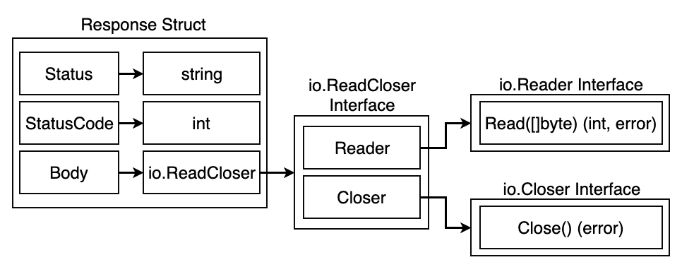
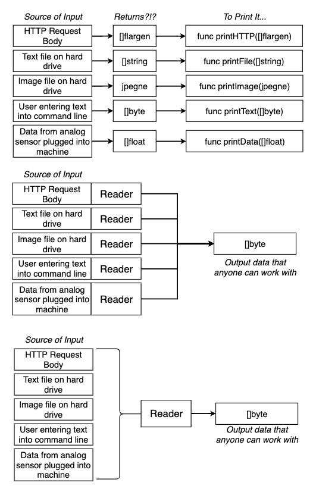

### Types
 There are two kind of types:
 - Concrete types: we can create values from these types eg. type deck []string, type user struct{} etc.
 - Interface types: we cannot create values from these types eg. type car interface {}

 Why are they helpful?
 - they help reduce the boilerplate code
 - they can be further nested reduce the amount of code
 - every value has a type and every function has to specify the type of it's arguments
 - so avoid rewriting funcions with the same functionality but different types of inputs and returns we use interfaces

eg. http.Response struct is made up of multiple interfaces

This is how a common reader interface simplifies interacting with various types of data reading inputs

Key pointers on interfaces:
- interfaces can be satisfied implicitly ie. we don't need to specify that some type satisfies an interface
- a type successfully satisfies an interface if it implements all the functions that are contained in the interface
- interfaces don't dictate the implementation of it's functions