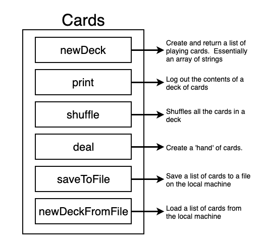

## Programming constructs

### App overview


### Loops
```
// this will throw an error in go because "index" is not used inside the loop
for index, card := range cards {
    fmt.Println(card)
}
```